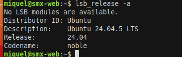
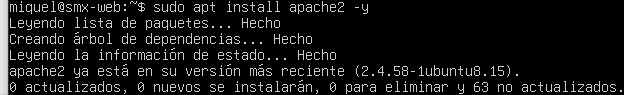
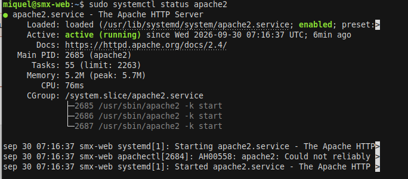
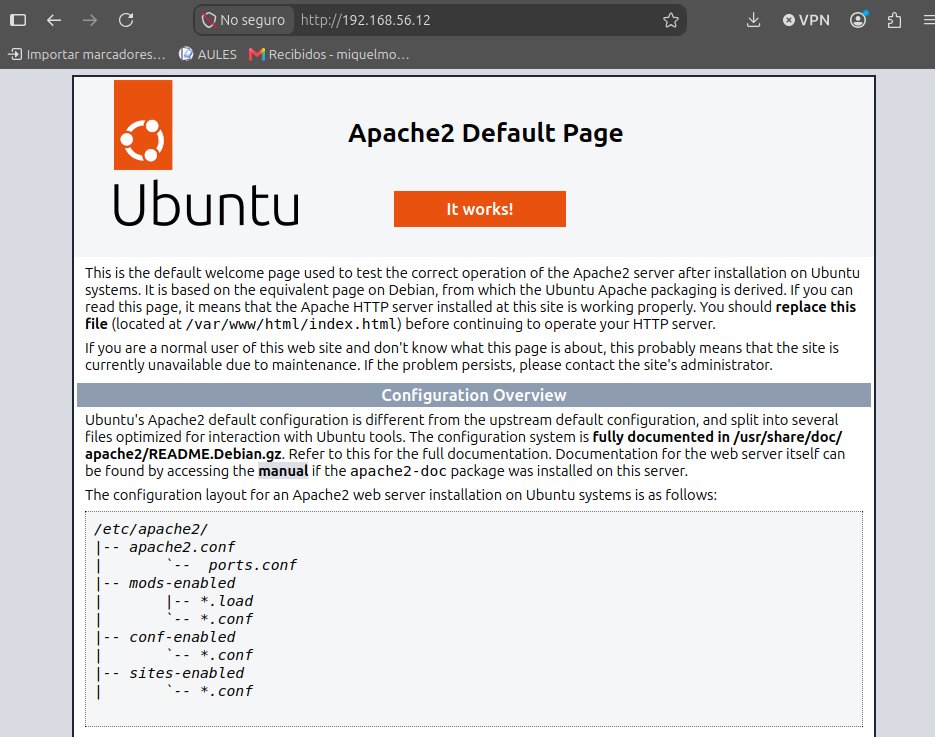

# Instalación y Securización de Apache

## Captura
Es una imagen despues de actualizar.

-----------------------------------
## Instalacion de apache2

A la hora de instalar se instlaron paquetes adicionales como independecias: 
**libfwupd2 y libgusb2**

----------------------------------
## Comprobación del funcionamiento

### Captura
Imagen del status de apache2

### Captura del navegador
 

-----------------------------------------------------------
